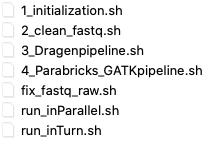
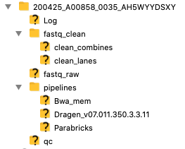
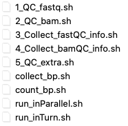
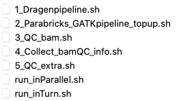

# DGV4VN ANALYSIS PROCEDURE

There are 3 big steps in the analysis procedure: I_MAIN_FLOW, II_QC_AND_PROCESS_QC_RESULT, III_TOPUP_CASES

<!-- TABLE OF CONTENTS -->
## Table of Contents
* [STEP I: I_MAIN_FLOW](#STEP-I:-I_MAIN_FLOW)
    * [Prerequisites](#Prerequisites)
    * [I-1. Initialize Run directory](#I-1.-Initialize-Run-directory)
    * [I-2. Pre-process raw fastq - Clean](#I-2.-Pre-process-raw-fastq---Clean)
    * [I-3. Run Dragen pipeline](#I-3.-Run-Dragen-pipeline)
    * [I-4. Run GATK pipeline on parabricks](#I-4.-Run-GATK-pipeline-on-parabricks)
* [STEP II: II_QC_AND_PROCESS_QC_RESULT](#STEP-II:-II_QC_AND_PROCESS_QC_RESULT)
    * [Prerequisites](#Prerequisites)
    * [II-1. QC fastq files](#II-1.-QC-fastq-files)
    * [II-2. QC bam files](#II-2.-QC-bam-files)
    * [II-3. Run QC extra](#II-3.-Run-QC-extra)
    * [Prerequisites](#Prerequisites)
* [STEP III: III_TOPUP_CASES](#STEP-III:-III_TOPUP_CASES)
    * [Prerequisites](#Prerequisites)
    * [III-1. Run Dragen pipeline](#III-1.-Run-Dragen-pipeline)
    * [III-2. Run GATK pipeline on parabricks](#III-2.-Run-GATK-pipeline-on-parabricks)
    * [III-3. QC bam files ](#III-3.-QC-bam-files )
    * [III-4. Run QC extra](#III-4.-Run-QC-extra)
* [Contributing](#Contributing)
    
## STEP I: I_MAIN_FLOW

The main flow is implemented from bcl files to vcf files.

### Prerequisites

All scripts are saved in `/dragennfs/area1/analysis/script/I_MAIN_FLOW`

```sh
cd /dragennfs/area1/analysis/script/I_MAIN_FLOW
```
<p align="center">
    <a href="https://drive.google.com/open?id=10vs_y8riMtFCMtPiGWqg4aopGIOQfDyb">
        
    </a>
</p>
### I-1. Initialize Run directory

Create the hierachy of directory for the Run (given by `$RUN_ID` i.e `200427_A00858_0036_AH5Y37DSXY`) in `/dragennfs/area4/analysis/$RUN_ID/`.

Run bcl2fastq to convert bcl files to fastq files saved in folder `/dragennfs/area4/analysis/$RUN_ID/fastq_raw`.

```sh
bash 1_initialization.sh $RUN_ID
```
<p align="center">
    <a href="https://drive.google.com/open?id=10vs_y8riMtFCMtPiGWqg4aopGIOQfDyb">
        
    </a>
</p>

In case of errors in sample name, use script `fix_fastq_raw.sh` to fix. Command:
```sh
bash fix_fastq_raw.sh $RUN_ID
```

### I-2. Pre-process raw fastq - Clean

Clean the raw fastq files. The output is then stored in `/dragennfs/area4/analysis/$RUN_ID/fastq_clean/`

```sh
# Use default list.csv for all samples in the RUN
bash run_inParallel.sh 2_clean_fastq.sh $RUN_ID

# Use custom list for selected samples in the RUN
bash run_inParallel.sh 2_clean_fastq.sh $RUN_ID $custom_list
```

### I-3. Run Dragen pipeline

Run Dragen pipeline on the clean fastq files. The output is then stored in `/dragennfs/area4/analysis/$RUN_ID/pipelines/Dragen_v07.011.350.3.3.11/`

```sh
# Use default list.csv for all samples in the RUN
bash run_inTurn.sh 3_Dragenpipeline.sh $RUN_ID

# Use custom list for selected samples in the RUN
bash run_inTurn.sh 3_Dragenpipeline.sh $RUN_ID $custom_list
```
### I-4. Run GATK pipeline on parabricks

Run GATK best practice pipeline on the clean fastq files. The output bam files are then stored in `/dragennfs/area4/analysis/$RUN_ID/pipelines/Bwa_mem/`. 
The output gvcf files are then stored in `/dragennfs/area4/analysis/$RUN_ID/pipelines/Parabricks/GATK_v4.0/`

```sh
# Use default list.csv for all samples in the RUN
bash run_inTurn.sh 4_Parabricks_GATKpipeline.sh $RUN_ID

# Use custom list for selected samples in the RUN
bash run_inTurn.sh 4_Parabricks_GATKpipeline.sh $RUN_ID $custom_list
```
## STEP II: II_QC_AND_PROCESS_QC_RESULT

The QC step is implemented on processed files of Step I. 

### Prerequisites

All scripts are saved in `/dragennfs/area1/analysis/script/II_QC_AND_PROCESS_QC_RESULT`

```sh
cd /dragennfs/area1/analysis/script/II_QC_AND_PROCESS_QC_RESULT
```

<p align="center">
    <a href="https://drive.google.com/open?id=10vs_y8riMtFCMtPiGWqg4aopGIOQfDyb">
        
    </a>
</p>

### II-1. QC fastq files

Run QC on the fastq files (raw and clean). The output is generated in `/dragennfs/area4/analysis/$RUN_ID/qc/`.

```sh
# Use default list.csv for all samples in the RUN
bash run_inParallel.sh 1_QC_fastq.sh $RUN_ID

# Use custom list for selected samples in the RUN
bash run_inParallel.sh 1_QC_fastq.sh $RUN_ID $custom_list
```
To quickly collect infomation for the report table (sheet Run_1_9: reads, Q20, Q30) use the command

```sh
# Use default list.csv for all samples in the RUN
bash 3_Collect_fastQC_info.sh $RUN_ID

# Use custom list for selected samples in the RUN
bash 3_Collect_fastQC_info.sh $RUN_ID $custom_list
```
In case of error in counting base pair, use `count_bp.sh` and `collect_bp.sh` to fix. Command:
```sh
# Use default list.csv for all samples in the RUN
bash run_inTurn.sh count_bp.sh $RUN_ID
bash collect_bp.sh $RUN_ID

# Use custom list for selected samples in the RUN
bash run_inTurn.sh count_bp.sh $RUN_ID $custom_list
bash collect_bp.sh $RUN_ID $custom_list
```

### II-2. QC bam files

Run QC on the bam files. The output is then stored in `/dragennfs/area4/analysis/$RUN_ID/pipelines/Dragen_v07.011.350.3.3.11/`

```sh
# Use default list.csv for all samples in the RUN
bash run_inParallel.sh 2_QC_bam.sh $RUN_ID

# Use custom list for selected samples in the RUN
bash run_inParallel.sh 2_QC_bam.sh $RUN_ID $custom_list
```
To quickly collect infomation for the report table (sheet alignment: coverage 4x, 15x, over reference genome) use the command

```sh
# Use default list.csv for all samples in the RUN
bash 4_Collect_bamQC_info.sh $RUN_ID

# Use custom list for selected samples in the RUN
bash 4_Collect_bamQC_info.sh $RUN_ID $custom_list
```

### II-3. Run QC extra

Run extra QC for bam files and vcf files for further analysis ( pipeline on the clean fastq files. 
The output is then stored in `/dragennfs/area4/analysis/$RUN_ID/pipelines/Dragen_v07.011.350.3.3.11/`

```sh
# Use default list.csv for all samples in the RUN
bash run_inParallel.sh 5_QC_extra.sh $RUN_ID

# Use custom list for selected samples in the RUN
bash run_inParallel.sh 5_QC_extra.sh $RUN_ID $custom_list
```

## STEP III: III_TOPUP_CASES

This step is for the topup cases of the Run. After step [I-1](#I-1.-Initialize-Run-directory), check `/dragennfs/area4/analysis/$RUN_ID/` if list_topup.csv exists.

### Prerequisites

All scripts are saved in `/dragennfs/area1/analysis/script/III_TOPUP_CASES`

```sh
cd /dragennfs/area1/analysis/script/III_TOPUP_CASES
```

<p align="center">
    <a href="https://drive.google.com/open?id=10vs_y8riMtFCMtPiGWqg4aopGIOQfDyb">
        
    </a>
</p>

Add two more columns (column for First_RUN_ID and Second_RUN_ID) to `/dragennfs/area4/analysis/$RUN_ID/list_topup.csv`.
Example:


<sub><sup>VN_01_00_0001&nbsp;&nbsp;&nbsp;/dragennfs/area1/analysis/190610_A00858_0010_AHLHLYDSXX/&nbsp;&nbsp;&nbsp;/dragennfs/area3/analysis/191218_A00858_0020_BHWTJ7DSXX/<br>
VN_01_01_0002&nbsp;&nbsp;&nbsp;/dragennfs/area1/analysis/190610_A00858_0010_AHLHLYDSXX/&nbsp;&nbsp;&nbsp;/dragennfs/area3/analysis/191218_A00858_0020_BHWTJ7DSXX/<br>
VN_01_01_0003&nbsp;&nbsp;&nbsp;/dragennfs/area1/analysis/190610_A00858_0010_AHLHLYDSXX/&nbsp;&nbsp;&nbsp;/dragennfs/area3/analysis/191218_A00858_0020_BHWTJ7DSXX/<br>
VN_01_01_0004&nbsp;&nbsp;&nbsp;/dragennfs/area1/analysis/190610_A00858_0010_AHLHLYDSXX/&nbsp;&nbsp;&nbsp;/dragennfs/area3/analysis/191218_A00858_0020_BHWTJ7DSXX/<br>
VN_01_01_0006&nbsp;&nbsp;&nbsp;/dragennfs/area1/analysis/190610_A00858_0010_AHLHLYDSXX/&nbsp;&nbsp;&nbsp;/dragennfs/area3/analysis/191218_A00858_0020_BHWTJ7DSXX/<br>
VN_01_00_0007&nbsp;&nbsp;&nbsp;/dragennfs/area1/analysis/190610_A00858_0010_AHLHLYDSXX/&nbsp;&nbsp;&nbsp;/dragennfs/area3/analysis/191218_A00858_0020_BHWTJ7DSXX/<br>
VN_01_01_0008&nbsp;&nbsp;&nbsp;/dragennfs/area1/analysis/190610_A00858_0010_AHLHLYDSXX/&nbsp;&nbsp;&nbsp;/dragennfs/area3/analysis/191218_A00858_0020_BHWTJ7DSXX/</sub></sup>

### III-1. Run Dragen pipeline

Merge two bam files generated by dragen-aligner and run Dragen pipeline for the variant calling step. The output files are stored in
`/dragennfs/area4/analysis/$RUN_ID/pipelines/Dragen_v07.011.350.3.3.11/topup_samples/`

```sh
# Use default list.csv for all samples in the RUN
bash run_inTurn.sh 1_Dragenpipeline.sh $RUN_ID

# Use custom list for selected samples in the RUN
bash run_inTurn.sh 1_Dragenpipeline.sh $RUN_ID $custom_list
```
### III-2. Run GATK pipeline on parabricks

Merge two bam files generated by bwa-mem and run GATK-HC for the variant calling step. The output files are then stored in
`/dragennfs/area4/analysis/$RUN_ID/pipelines/Parabricks/GATK_v4.0/topup_samples/`

```sh
# Use default list.csv for all samples in the RUN
bash run_inTurn.sh 2_Parabricks_GATKpipeline_topup.sh $RUN_ID

# Use custom list for selected samples in the RUN
bash run_inTurn.sh 2_Parabricks_GATKpipeline_topup.sh $RUN_ID $custom_list
```

### III-3. QC bam files 

Run QC on the bam files. The output is then stored in `/dragennfs/area4/analysis/$RUN_ID/pipelines/Dragen_v07.011.350.3.3.11/`

```sh
# Use default list.csv for all samples in the RUN
bash run_inParallel.sh 3_QC_bam.sh $RUN_ID

# Use custom list for selected samples in the RUN
bash run_inParallel.sh 3_QC_bam.sh $RUN_ID $custom_list
```
To quickly collect infomation for the report table (sheet alignment: coverage 4x, 15x, over reference genome) use the command

```sh
# Use default list.csv for all samples in the RUN
bash 4_Collect_bamQC_info.sh $RUN_ID

# Use custom list for selected samples in the RUN
bash 4_Collect_bamQC_info.sh $RUN_ID $custom_list
```

### III-4. Run QC extra

Run extra QC for bam files and vcf files for further analysis ( pipeline on the clean fastq files. The output is then stored in
`/dragennfs/area4/analysis/$RUN_ID/pipelines/Dragen_v07.011.350.3.3.11/`

```sh
# Use default list.csv for all samples in the RUN
bash run_inParallel.sh 5_QC_extra.sh $RUN_ID

# Use custom list for selected samples in the RUN
bash run_inParallel.sh 5_QC_extra.sh $RUN_ID $custom_list
```
## Contributing

* **Ha Trang - trangth18** - *Initial work* 
* **Tuan Do - tuandn8** - *combine code and extract info* 
* **Tuan Nguyen - tuannt44** - *combine code and extract info* 
* **Hau Le -hauld1** - *Corresponding and responsibility* 

## License

This project is licensed under the MIT License - see the [LICENSE.md](LICENSE.md) file for details


